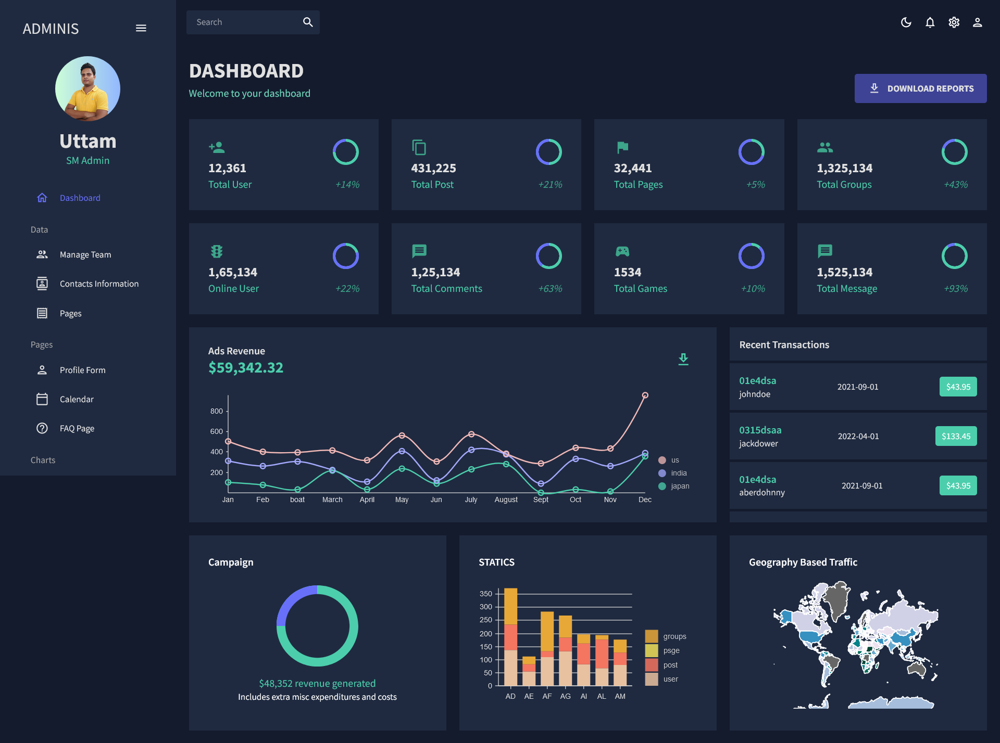

# Social Media Dashboard UI

This project is a social media dashboard user interface built using ReactJS and Material UI. It includes several features to enhance the user experience and provide valuable insights.

## Features

1. **Light and Dark Mode**: Toggle between light and dark modes for comfortable viewing in different environments.

2. **Collapsible Sidebar**: The sidebar is collapsible, allowing users to maximize screen space as needed.

3. **Dashboard Metrics**:

   - Total Users
   - Total Posts
   - Total Pages
   - Total Groups
   - Online Users
   - Total Comments
   - Total Games
   - Total Messages

4. **Recent Transaction History**: Display recent transaction history for easy tracking and analysis.

5. **Total Ads Revenue with Line Chart**: Visual representation of the total ads revenue using a line chart for better insights.

6. **Static Bar Chart Based on Data**:

   - User Data
   - Pages Data
   - Post Data
   - Group Data

7. **Geography Based Traffic with Geography Chart**: View geography-based traffic using a chart for a better understanding of user engagement.

## Screenshots

### Dashboard Overview



## Live site

Check out the live demo [here](https://digitaluttam.com/dashboard).

## Getting Started

1. Clone the repository:

   ```bash
   git clone <repository_url>
   cd social-media-dashboard-ui

   ```

2. Install dependencies:

   ```npm install

   ```

3. Start the development server:

   ```npm start

   ```

4. Open http://localhost:3000 to view the app in your browser.

## Contributing

If you'd like to contribute to this project, please follow these guidelines:

Fork the repository
Create your feature branch (git checkout -b feature/YourFeature)
Commit your changes (git commit -m 'Add some feature')
Push to the branch (git push origin feature/YourFeature)
Open a pull request

## License

This project is licensed under the MIT License.
